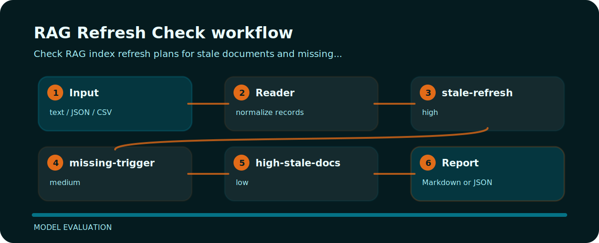

# RAG Refresh Check


Check RAG index refresh plans for stale documents and missing rebuild triggers. The command is intentionally direct so it can sit in a local review, a CI step, or a one-off audit.

## Checks in plain language

| Signal | Level | What it flags | Fix direction |
| --- | --- | --- | --- |
| `stale-refresh` | high | index refresh is stale | schedule rebuild |
| `missing-trigger` | medium | rebuild trigger missing | define rebuild trigger |
| `high-stale-docs` | low | stale docs noted | measure and reduce stale documents |

## Tiny fixture

```text
risky: last_refresh 2024 rebuild_trigger none stale_docs high
clean: last_refresh 2026 rebuild_trigger docs_changed stale_docs low
```

## Fresh clone path

```bash
git clone https://github.com/mertefekurt/rag-refresh-check.git
cd rag-refresh-check
python -m pip install -e ".[dev]"
rag-refresh-check examples/sample.txt
```

## Finding map


